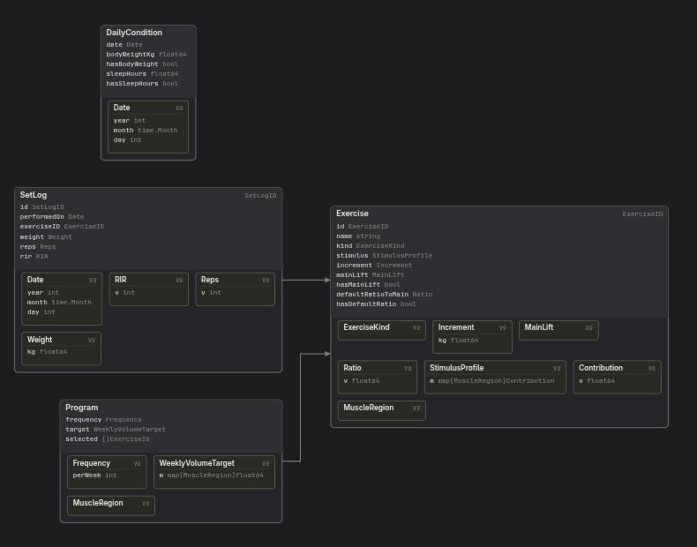

# dddviz

Draw a map of the aggregates in a Go DDD codebase.



> **The name is a placeholder.** It will be reconsidered once the tool has
> been lived with for a while.

## What it does

The only thing you write in your code is `//ddd:aggregate`, on aggregate
roots. Everything else — what an aggregate contains, which types are
entities and which are value objects, how identifier types pair up, and how
aggregates reference each other — is inferred.

```go
//ddd:aggregate
type Order struct {
	id       OrderID
	customer CustomerID
	lines    []OrderLine
	total    Money
}
```

```console
$ dddviz -C ~/repos/myapp -o docs/domain.html ./internal/...
wrote docs/domain.html (3 aggregates, 2 references, 23 unclassified)
```

The output is one HTML file with no dependencies. Aggregates become frames,
their contents nest inside, and ID references connect them.

- Click an aggregate to **expand or collapse** it. Collapsed, the diagram is
  a map between aggregates; expanded, it shows what is inside. These are two
  zoom levels of one diagram rather than two separate diagrams
- Hover to **highlight what a type relates to** and dim the rest
- Drag to pan, wheel to zoom, `f` to fit on screen

Use `-format json` to get just the analysis.

### Starting from nothing

Run it before marking anything and it will say so, and point at the types
that at least own an ID type:

```console
$ dddviz -C ~/repos/myapp ./internal/...

dddviz: no aggregates found -- nothing is marked with //ddd:aggregate

  Candidates, from types that own an ID type:
    Exercise                 exercise.go:96         (ExerciseID)
    SetLog                   set_log.go:55          (SetLogID)

  Owning an ID does not make a type an aggregate root, so treat
  these as a starting point rather than an answer.
```

## Watching

```console
$ dddviz -watch -C ~/repos/myapp ./internal/...
dddviz: serving http://127.0.0.1:41533 (3 aggregates, 2 references)
dddviz: watching /home/you/repos/myapp -- press Ctrl-C to stop
```

This serves the diagram, opens a browser, and redraws whenever the code
changes. `-port` fixes the port, `-no-open` skips the browser.

The server pushes a new diagram rather than reloading the page, so **the
aggregates you had expanded stay expanded** across an edit. While the code
does not compile — which is most of the time while you are typing — the last
good diagram stays on screen and the build error appears in a banner.

No file-watching or WebSocket library is involved. `go install` is the whole
setup, and keeping it that way is worth more than either dependency.

## Why one marker is necessary

"An aggregate root is a root of the reference graph, so it can be inferred" —
in practice this does not hold.

Trying "types nothing references are roots" against a real codebase turned up
constructor-argument DTOs, domain services and request/response DTOs, and not
one actual aggregate root.

The reason is structural: in Go it is **aggregate roots that get referenced**,
by ID, so their reference count is never zero. The types with no references
are the DTOs and the services. The hypothesis is backwards.

"Types that own an ID type are roots" fails differently — it misses a
`Program` that has no `ProgramID`.

So dddviz asks the human about the one thing that cannot be inferred, and
infers the rest.

## What is inferred

| Inferred | How |
|---|---|
| Aggregate contents | Types reachable by following fields from the root, minus other aggregate roots |
| Entity vs. value object | Pointer receivers plus a field of the type's own identifier type means entity |
| Identifier pairing | An `Order` marked `//ddd:aggregate` pairs with `OrderID` |
| References between aggregates | A field in aggregate A holding B's ID type means A → B |
| Unclassified | Types no aggregate root can reach. Usually services and DTOs, but a forgotten marker shows up here too |

`//ddd:id for=Order` states the pairing when naming departs from the convention.

The marker is prefixed `ddd:` rather than with the tool's name. It goes into
your source, so it should stay neutral rather than tie the code to one tool.

## Why the page is one file

elkjs is embedded in the binary, which puts the generated HTML at around
1.6MB. Precomputing the layout would remove the need for JS, but every
expand and collapse relayouts, so that would mean storing coordinates for
every combination of open frames.

Nothing is fetched from a CDN and no stylesheet is external, so the output
can be committed straight into a repository.

## Install

```console
$ go install github.com/dyoshyy/dddviz/cmd/dddviz@latest
```

## License

MIT. See [LICENSE](LICENSE).

## Status

Verified against a real Go DDD domain layer (3 aggregates, 17 files) for both
analysis and rendering.

Not addressed yet:

- Behavioural flow (use case → repository call chains)
- Layering violations
- Breaking down the unclassified list, which mixes services, DTOs, and types
  belonging to work still in progress
